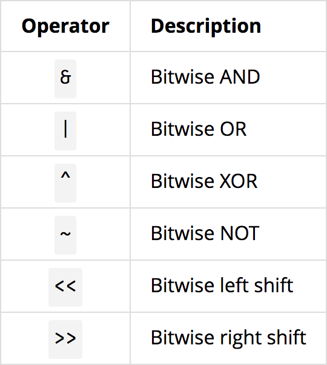

# Het aantal bits tellen

Eigenlijk is dit makkelijker dan je denkt.
Je kan je python openen op je computer en een math functie uitvoeren.

Hoe doe je dit? Je hebt 2 parameters nodig, het aantal `combinaties` en het `aantal keer` dat het opgeslagen moet worden.

```python
math.ceil(math.log2(combinaties) * aantal)
```

# Bitwise operator

Je kan gebruik maken van de volgende operators.



Je kan best eens kijken naar de oplossingen van de examenvragen. 
Als je bijvoorbeeld iets wilt optellen, kan je beter `|` gebruiken.
Voor zo getallen met heel veel nullen best die `&`.
Als je een hexadecimaal cijfer naar links wil shiften is het `<<` met 4, `>>` voor naar rechts te shiften.

# Types

Dit is echt nog gemakkelijker dan de 2 onderwerpen hierboven

Wat je dus altijd moet doen is het aantal sterretjes optellen of aftrekken.

`*` -> -1

`&` -> +1

# Classes

Dit is een iets moeilijker gedeelte, maar je kan wel bepaalde dingen meteen zien.

Bij bijvoorbeeld Foo foo, wordt de constructor opgeroepen, toch als er geen parameters zijn, en wordt dat geprint, maar bij het eindigen van de functie wordt de Foo ook gedeconstruct (~Foo()), en wordt dit als hij uit de functie gaat, opgeroepen.

# De "You are given" vragen

Deze kan je oplossen door telkens het stukje code te plakken in `given.cpp`. En het type T te vervangen door bijvoorbeeld een int.
Dan kan je zien welke geen rode error kleur heeft.


# Pass function

### Hulpmiddel


# Hoe mijn cpp files runnen ?

Ik maak geen gebruk van Visual Studio, maar van visual studio code, dit doe ik door middel van de C++ extension pack in combinatie van code-runner.

De eerste extensie die je nodig hebt is deze: https://code.visualstudio.com/docs/languages/cpp
Het is uiterst belangrijk hun documentatie te volgen, ik ga niet voor iedereen individueel komen helpen hiermee.

Vervolgens heb je de plugin: https://marketplace.visualstudio.com/items?itemName=formulahendry.code-runner

Dit is hoe ik het gedaan heb, maar er zijn vast nog andere manieren.